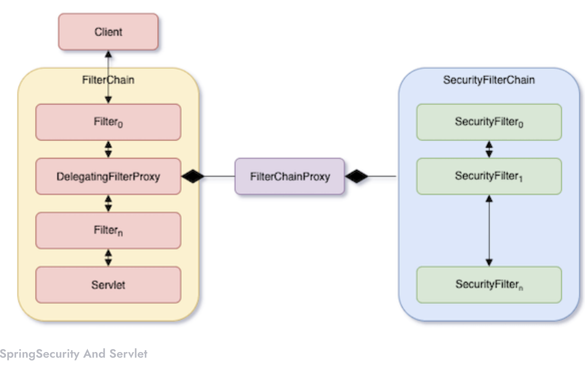
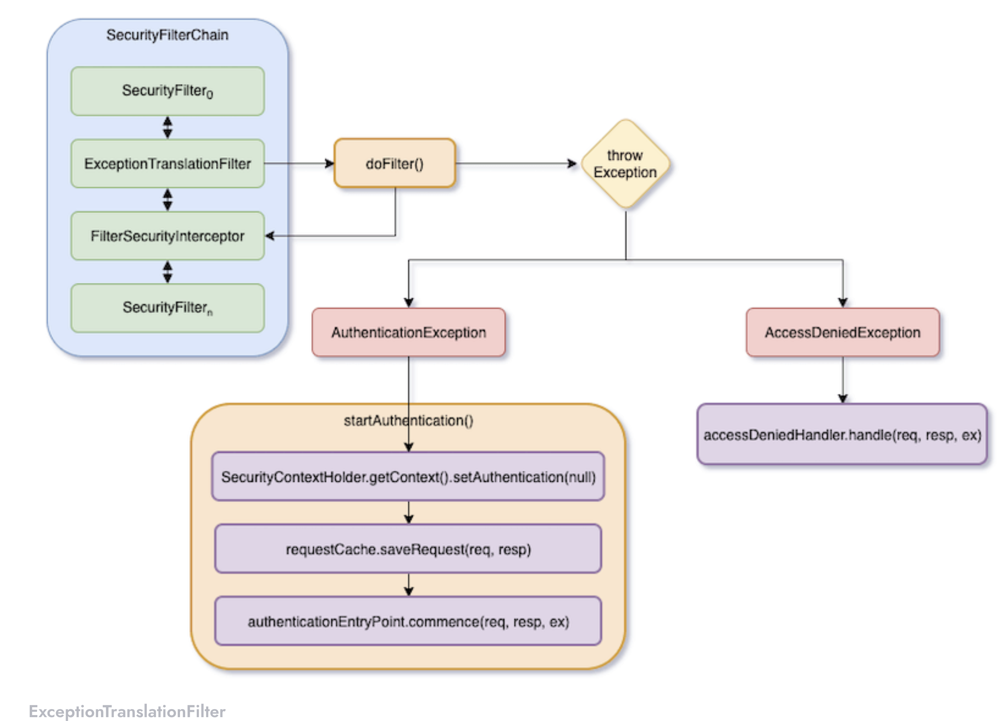
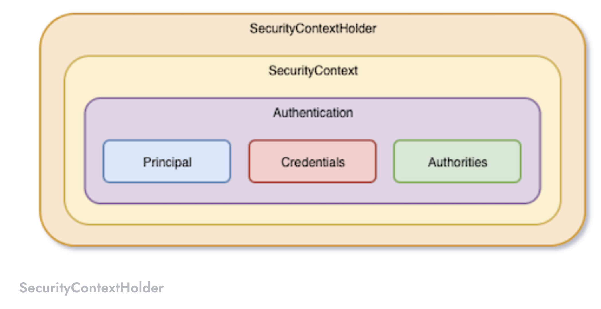

# Spring Security Architecture

Spring Security is an authentication framework officially recommended by Spring. Its power is well known, but its complexity is notorious. Spring Security abstracts almost all components, so that it is impossible to understand intuitively. 

# Spring Security and Servlet

Before understanding the architecture of Spring Security, let us take a look at how Spring Security works with Servlet. The following figure shows the flow of Servlet and Spring Security when an HTTP request comes in.

## ExceptionTranslationFilter

## SecurityContextHolder

SecurityContextHolder is used to store authenticated Authentication objects. Its structure is roughly as shown in the figure below.

