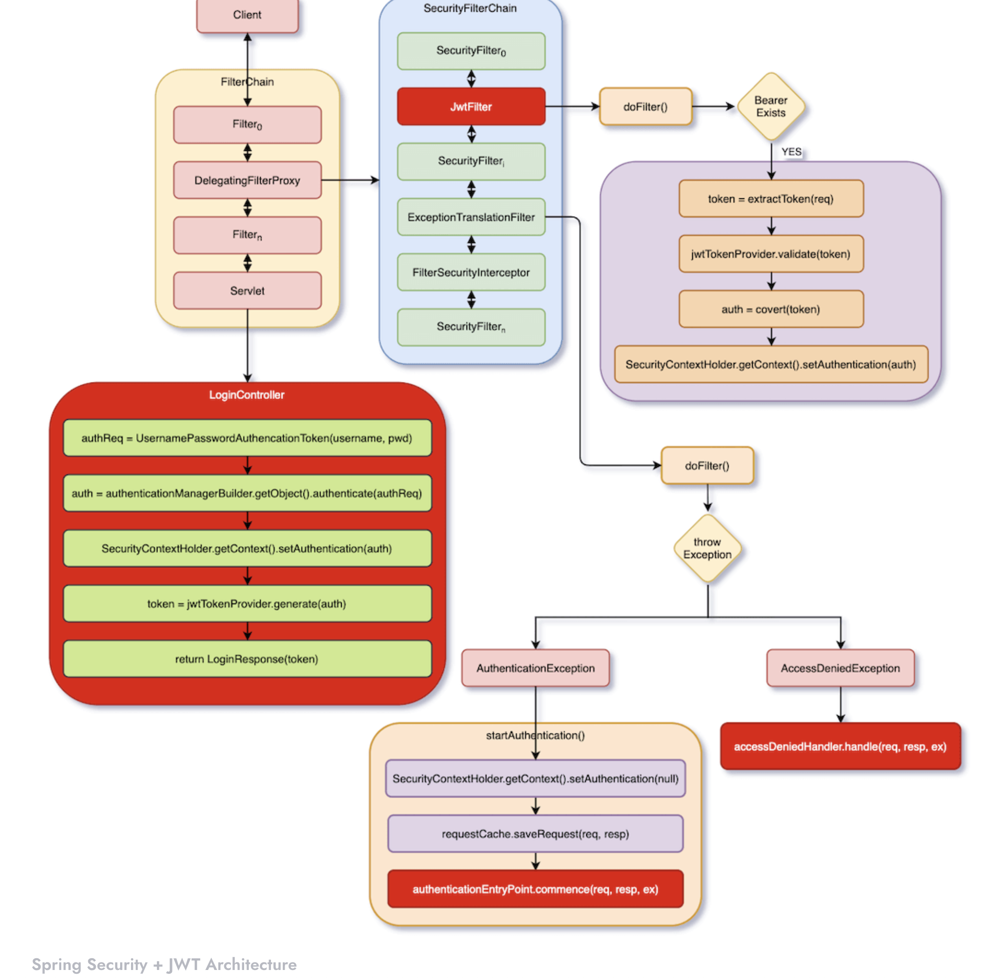

# Spring Security JWT Authentication with JPA and Springdoc 

Shows JWT-Token-Based authentication in Spring Security, how to read username and password from JPA for login verification, how to generate JWT Tokens, and how to verify JWT Tokens and finally shows how to integrate with Springdoc.

## JWT-Token-Based Authentication

In recent years, frontend is no longer only web pages, but also includes mobile phones (Android/iOS). In the early days, web page code was output by backend, such as PHP, ASP, and JSP. Under these architectures, frontend and backend use cookies to record session IDs. And these session IDs are also used to check whether users have been logged in. This process is called Form Login.

## JWT-Token-Based Authentication Flow

Before starting to program, let’s have a brief understanding of the flow we want to implement, as shown in the following figure:

To implement our flow in Spring Security, the idea is to insert JwtFilter in SecurityFilterChain. It obtains a JWT token from HTTP request header, and verify if the received JWT token is valid. Finally, convert the JWT token into an Authentication object and set it into SecurityContextHolder, which means that this HTTP request or session has been authenticated.

If it is, there is no JWT token in header, or JWT Token is illegal, then an exception will be thrown in FilterSecurityInterceptor, and ExceptionTranslationFilter will handle this exception. In the original flow, both authenticationEntryPoint.commence() and accessDeniedHandler.handle() perform redirection. However, now we only want them to return error messages, so these two methods must be reimplemented.

If POST /login comes in, it will pass JwtFilter, ExceptionTranslatorFilter and FilterSecurityInterceptor, because we will set /login without permission. So, it will eventually reach LoginController.login().

LoginController.login() authenticates users and return a JWT token. After that, frontend can use this JWT token to access backend’s APIs.