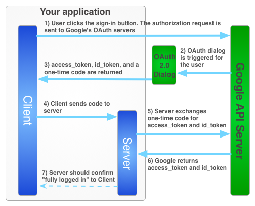

# Spring Security JWT Authentication with Google Sign-In

Login with Google Sign-In on frontend, get an authorization code and pass it to a Spring Security backend. After backend verify with Google, pass JWT to frontend. In the process, compare the email obtained from Google Sign-In with the account read from JPA.

Dependencies :

- **Spring Web**
- **Spring Security**
- **Spring OAuth2 Client**
- **Spring Data JPA**
- **Spring H2 Database**
- **JSON-P or Jackson**
- **Spring cache abstraction**
- **Jsonwebtoken**

## Problems with OAuth Login

Spring Security’s OAuth Login allows us to login through Google Sign-In. The flow of OAuth Login is that backend sends an Authorization Code request to OAuth server. Then, OAuth server redirects frontend to login screen. After frontend login, OAuth server sends an authorization code to backend. Finally, backend sends a request to OAuth server to verify the authorization code, client ID, and client secret. After OAuth server authenticates successfully, it returns an ID token and access token to backend.

## OAuth2 + JWT-Token-Based Authentication

This method combines OAuth Login and JWT-Token-Based modes. The general flow will be as described in [Google Sign-In for server-side apps](https://developers.google.com/identity/sign-in/web/server-side-flow) , as shown in the figure below.

Frontend sends an authorization request to Google API Server, and redirects to OAuth 2.0 login screen. After users login, return id_token and access_token to the front end. Frontend sends id_token and access_token to backend. Backend will use id_token and access_token to verify with Google API Server. If the verification succeeds, frontend will be notified that the login is successful, and the entire flow is roughly completed.

The difference from the above is that we will ask Google API Server for authorization code on frontend, and send it to the backend. Backend will send authorization code, client ID, and client secret to Google API Server for verification. After success, the received OAuth information is made into JWT and sent to frontend. After that, frontend uses JWT for authentication, the same as the JWT-Token-Based Authentication.

## OAuth2 + JWT-Token-Based Authentication Flow
Before starting to program, let’s first understand the flow we want to implement, as shown in the following figure:

The idea is to add two filters to SecurityFilterChain, namely RestOAuth2AuthorizationFilter and RestOAuth2AuthenticationFilter. When logging in, RestOAuth2AuthenticationFilter returns a JWT to frontend. After that, frontend’s requests will carry this JWT, and RestOAuth2AuthorizationFilter will be responsible for verifying this JWT.