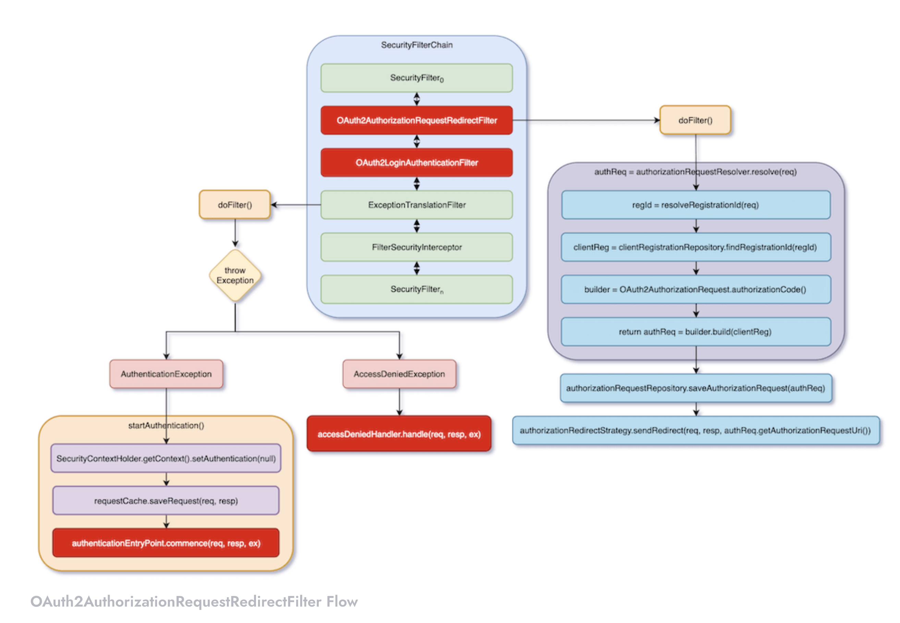

# Spring Security OAuth Login with Google Sign-In

Spring Security‘s OAuth Login in a simple way

Dependencies : 

- **Spring Web**
- **Spring Security**
- **Spring OAuth2 Client**

## OAuth 2 Authentication

OAuth Login of Spring Security provides OAuth 2.0 login authentication. In OAuth 2.0 Authentication Framework, Authorization Grant has 4 modes, namely:

- Authorization Code
- Implicit
- Resource Owner Password Credentials
- Client Credentials

Spring Security’s OAuth Login only supports Authorization Code Grant mode, such as GitHub. In addition, it also supports the OpenID Connect Authorization Code Grant mode, such as Google.

The flow of Authorization Code is:

1. A user clicks login link on Web App.
2. Web App requests authorization code from a OAuth server.
3. The OAuth server redirects the user to login screen.
4. The user uses an account to login to the OAuth server.
5. The OAuth server verifies the user’s account and password. After the verification succeeds, it redirects to the Web App with an authorization code.
6. The Web App requests /oauth/token of the OAuth Server with authorization code, client ID, and client secret.
7. OAuth server verifies the authorization code, client ID, and client secret.
8. If the verification succeeds, return to Web App with ID token and access token. There may also be a refresh token, but this is optional.
9. The overall flow is completed at the previous step. This step only means that Web App can use the access token to access the resources of the OAuth server, such as user data.
10. In the above flow, Google can be OAuth Server, and Web App can be a backend application (such as Spring Boot) or a frontend application (such as Angular).

# OAuth Login Using Google Sign-In

Spring Security automatically generates a login page, which is is /login by default. This login page has a link titled Google Sign In, and it connects to /oauth2/authorization/{registrationId}. In this example, the registrationId is google, and it also can be facebook or github etc. Spring Security parse out this registrationId and use different settings and flow according to it.

When registrationId is google, Google-related settings will be used. According to this settings, it will redirect to the login screen of Google Sign-In. After users login with Google accounts, it will redirect back to /login/oauth2/code/{registrationId}. And, this URI is also called Redirect URI.

When this redirect back to Spring Security, it will bring an authorization code. Spring Security will start Authorization Code Grant verification flow. Finally, it will obtain an ID token, access token, and refresh token.

## Spring Security OAuth Login Flow

The entire flow can be divided into three parts:

- **/oauth2/authorization/{registrationId} – OAuth2AuthorizationRequestRedirectFilter**
- **Google**
- **/login/oauth2/code/{registrationId} – OAuth2LoginAuthenticationFilter**

In the list, the first and third parts are processed by two Spring Security’s filters.

When a user accesses /oauth2/authorization/{registrationId}, the request will be intercepted by OAuth2AuthorizationRequestRedirectFilter. It will first determine registrationId based on URI. According to the previous example, it will be google. Then, use this registrationId to get ClientRegistration, which stores Google-related settings.

Next, according to ClientRegistration, it generates all verification data, including its URL, and all Query Parameters following the URL. Then, temporarily store this data, and then redirect to this URL for OAuth verification.

## OAuth2LoginAuthenticationFilter

When OAuth server redirects to Redirect URI /login/oauth2/code/{registrationId}, OAuth2LoginAuthenticationFilter will intercept the flow

## Spring Security OAuth 2.0 Architecture

We looked at the process of Spring Security OAuth Login from an overview perspective. After understanding the whole process, it helps to understand the details.

### OAuth2AuthorizationRequestRedirectFilter

The logic of OAuth2AuthorizationRequestRedirectFilter is actually quite simple. It is based on HTTP request URI to determine registrationId. Then, according to this registrationId, it gets ClientRegistration.

ClientRegistration is a very important data structure. Look carefully, it contains all the settings required by OAuth 2.0, such as Secret, AuthenticationGrantType, Redirect URL, Scopes, Authorization URL, Token URL, UserInfoEndpoint URL, etc. In other words, if you want to customize for an OAuth server, the most important thing is to provide a ClientRegistration for Spring Security. Of course, your OAuth server must use Authorization Code Grant mode.

After OAuth2AuthorizationRequestRedirectFilter obtains ClientRegistration, it passes ClientRegistration to OAuth2AuthorizationRequest. According to this information, OAuth2AuthorizationRequest can generate a HTTP request to request an authorization code.

### OAuth2LoginAuthenticationFilter

You will find OAuth2LoginAuthenticationFilter quite complicated. A lot of code and a lot of data structure are dazzling. The following figure shows the structure of OAuth2LoginAuthenticationFilter. Of course, it does not contain all data structures, but it contains most of it.