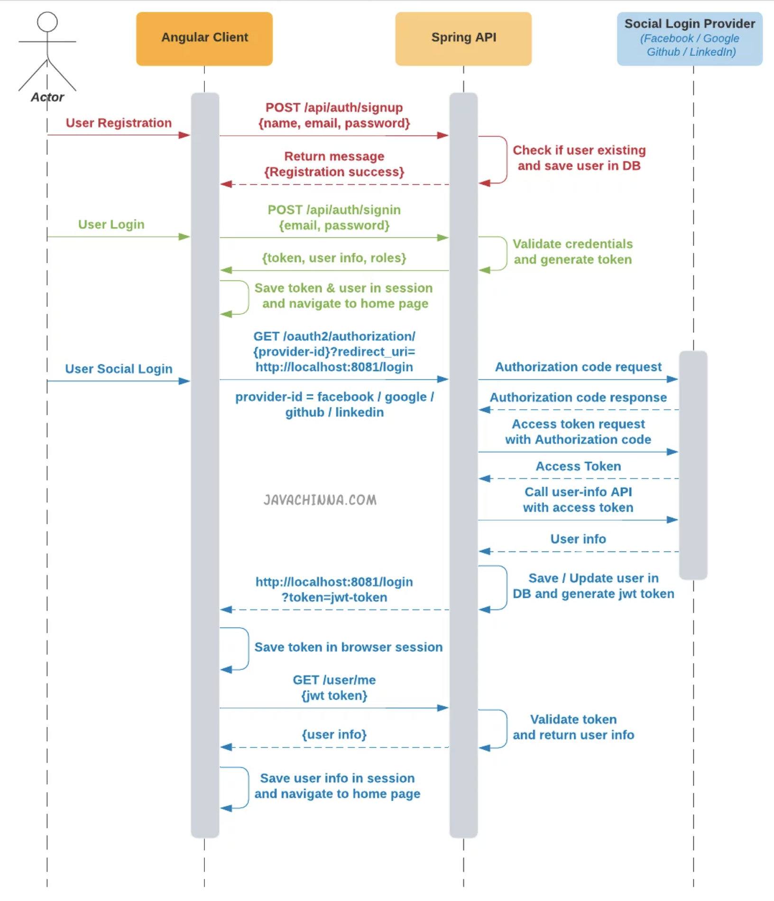

# Spring Boot 2 + Angular 10: User Login, Registration using JWT Authentication and OAuth2 Social Login with Facebook, Google, LinkedIn, and Github using Spring Security 5

Dependencies :

- **Spring Web**
- **Spring Security**
- **Spring OAuth2 Client**
- **Spring Data JPA**
- **MySQL Driver**
- **Jackson**
- **Lombok**
- **Jsonwebtoken**



## Application Properties

Spring Security 5 has in-built support for Google, Facebook, Github Social Login. We just need to configure the clientId, clientSecret and facebook.user-info-uri in the application.properties file.
Apart from this, we also need to configure provider, authorization-uri, token-uri, user-info-uri and user-name-attribute for LinkedIn Social Login.

## RestAuthenticationEntryPoint

This class is responsible for sending HTTP status 401 Unauthorized response when a user tries to access a protected resource without authentication.

## JWT Authentication

### Creating Token Provider

TokenProvider is responsible for token creation, validation, and getting user ID from the token. It makes use of the io.jsonwebtoken.Jwts for achieving this.


### Creating Token Authentication Filter

The TokenAuthenticationFilter extends the Spring Web Filter OncePerRequestFilter class. For any incoming request, this Filter class gets executed. It checks if the request has a valid JWT token. If it has a valid JWT Token then it sets the Authentication in the context, to specify that the current user is authenticated.

## OAuth2 Authentication

### Creating Custom OAuth2 Services

#### CustomOAuth2UserService

The CustomOAuth2UserService extends Spring Security’s DefaultOAuth2UserService and implements its loadUser() method. This method is called after an access token is obtained from the OAuth2 provider.

In this method, we first fetch the user’s details from the OAuth2 provider. If a user with the same email already exists in our database then we update his details, otherwise, we register a new user.

If the OAuth2 provider is LinkedIn, then we need to invoke the email address endpoint with the access token to get the user email address since it will not be returned in the response of user-info endpoint.

#### CustomOidcUserService

OidcUserService is an implementation of an OAuth2UserService that supports OpenID Connect 1.0 Providers. Google is an OpenID Connect provider. Hence, we are creating this service to load the user with Google’s OAuth 2.0 APIs.

The CustomOidcUserService extends Spring Security’s OidcUserService and implements its loadUser() method. This method is called after an access token is obtained from the OAuth2 provider.

In this method, we first fetch the user’s details from the OAuth2 provider. If a user with the same email already exists in our database then we update his details, otherwise, we register a new user.

### Creating Authorization Request Repository

The OAuth2 protocol recommends using a state parameter to prevent CSRF attacks. During authentication, the application sends this parameter in the authorization request, and the OAuth2 provider returns this parameter unchanged in the OAuth2 callback.

The application compares the value of the state parameter returned from the OAuth2 provider with the value that it had sent initially. If they don’t match then it denies the authentication request.

To achieve this flow, the application needs to store the state parameter somewhere so that it can later compare it with the state returned from the OAuth2 provider.

#### HttpCookieOAuth2AuthorizationRequestRepository

This class is responsible for storing and retrieving the OAuth2 authorization request and redirect_uri of the Angular client in the cookies.


### Creating Custom OAuth2 Access Token Response Converter

#### OAuth2AccessTokenResponseConverterWithDefaults.java 

LinkedIn OAuth2 access token API is returning only the access_token and expires_in values but not the token_type in the response. This results in the following error.

```shell
org.springframework.http.converter.HttpMessageNotReadableException: An error occurred reading the OAuth 2.0 Access Token Response: tokenType cannot be null; nested exception is java.lang.IllegalArgumentException: tokenType cannot be null
```

Hence the default OAuth2AccessTokenResponseConverter class has been copied as OAuth2AccessTokenResponseConverterWithDefaults and modified to set a default token type to resolve this issue.

### Creating Authentication Handlers

#### OAuth2AuthenticationSuccessHandler

On successful authentication, Spring security invokes the onAuthenticationSuccess() method of the OAuth2AuthenticationSuccessHandler configured in WebSecurityConfig.

This method,
- Fetches the redirect_uri sent by the angular client from the cookie and validates against the list of allowed URI’s configured in the application.properties. if it is unauthorized redirect_uri, then it throws an exception
- Creates a JWT authentication token
- Redirects the user to the angular client redirect_uri with the JWT token added in the query string.

#### OAuth2AuthenticationFailureHandler

On Authentication failure, Spring Security invokes the onAuthenticationFailure() method of the OAuth2AuthenticationFailureHandler that we have configured in WebSecurityConfig.

This method,
- Fetches the client redirect_uri from the cookie
- Removes Authorization request cookie as well ass redirect_uri cookie
- Redirects the user to the angular client with the error message added to the query string.

### Creating OAuth2 User Info Mappings

Every OAuth2 provider returns a different JSON response when we fetch the authenticated user’s details. Spring security parses the response in the form of a generic map of key-value pairs.

The following classes are used to get the required details of the user from the generic map of key-value pairs

- **OAuth2UserInfo**
- **FacebookOAuth2UserInfo** 
- **GithubOAuth2UserInfo**
- **GoogleOAuth2UserInfo**
- **LinkedinOAuth2UserInfo**
- **OAuth2UserInfoFactory**
